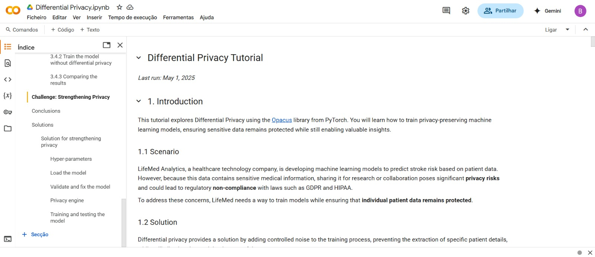
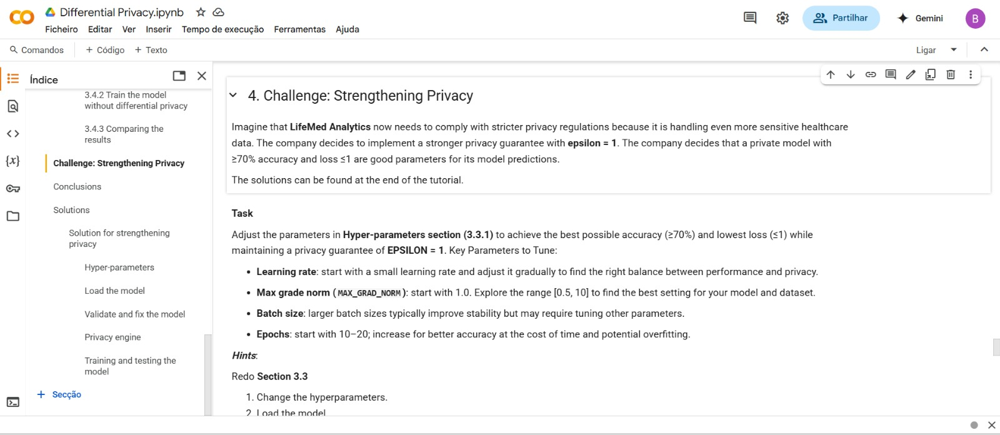

# 🧪 The PET Laboratory Guide

Welcome to the **PET Laboratory Guide** — a hands-on companion for learning and applying **Privacy Enhancing Technologies (PETs)** in real-world scenarios. This guide is designed to be practical, accessible, and interactive, helping engineers and learners explore PETs through code.

---

## 🔍 Overview

The lab centers around a **single healthcare dataset**, used across all tutorials to maintain consistency. You’ll work through real use cases like:

- 🧬 **Privacy-preserving data analysis**
- 🤝 **Collaborative model training without data sharing**
- 🔐 **Secure computations on sensitive attributes**

Each notebook in the guide follows a *cookbook-style* structure with:

- A clear problem scenario
- Step-by-step implementation
- Interactive exercises
- Code and validation examples

All tutorials run in **Google Colab**, requiring no local setup.

> ✅ Just open, run, and explore — it works straight from your browser.

*Live PET implementation in Google Colab.*

---

## 📚 Tutorials

The following PETs are implemented using Colab-compatible tools. Each link opens an interactive notebook with fully working code.

| PET                              | Tutorial                                                                                      |
|----------------------------------|-----------------------------------------------------------------------------------------------|
| **Synthetic Data (SD)**          | [Open Notebook](https://colab.research.google.com/drive/1h5NqIZDZKtV9WfIaFHFp4Qd6O_21bCOm?usp=sharing) |
| **Differential Privacy (DP)**   | [Open Notebook](https://colab.research.google.com/drive/16g49145eZUnPEEgIC_phnHClrb6pRCcG?usp=sharing) |
| **Distributed Learning (DL)**  | [Open Notebook](https://colab.research.google.com/drive/1xtVGzNHkPM5cMImY-oDqReMv5FtUCmG9?usp=sharing) |
| **Homomorphic Encryption (HE)** | [Open Notebook](https://colab.research.google.com/drive/1SuQxaVb15CaNQjIUKLtYIrqRarylmtOK?usp=sharing) |

> If you encounter dependency issues, run the provided `requirements.txt` at the start of each notebook.

---

## 🧩 Extended Challenges

Each tutorial includes an **optional challenge** that builds on the main scenario, encouraging deeper understanding through applied problem-solving. Example: simulate secure stroke risk prediction using encrypted or distributed data inputs.

*Bonus exercises simulate advanced use cases.*

---

## ⚠️ What’s Not Included (Yet)

Some PETs couldn’t be implemented in Colab due to technical constraints:

### ❌ Trusted Execution Environments (TEE)

- **Why not?** TEE platforms (e.g. Intel SGX) require dedicated CPU hardware not available in virtual Colab environments.
- **Alternatives:** Real TEE tutorials must run on compatible hardware or VMs.

### ❌ Zero-Knowledge Proofs (ZKP)

- **Why not?** Most ZKP frameworks (ZoKrates, Circom) are Rust/C++ based and require CLI tools or Docker, which Colab doesn't support.
- **Issues faced:** No Rust, limited memory, no root access, long preprocessing times.

### ❌ Secure Multi-Party Computation (SMPC)

- **Why not?** Frameworks like CrypTen need multi-processing and socket communication, both restricted in Colab.
- **Challenge:** Colab’s single-process model kills background jobs needed for SMPC.

> These PETs are better explored on local setups or dedicated servers with hardware and OS-level control.

---

## 🙋 Need Help?

If a notebook doesn’t run or you’d like to contribute a new example, please open an issue or pull request in the main repository.
