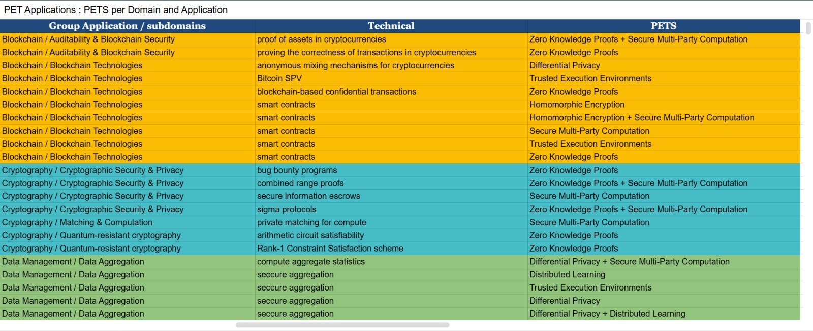
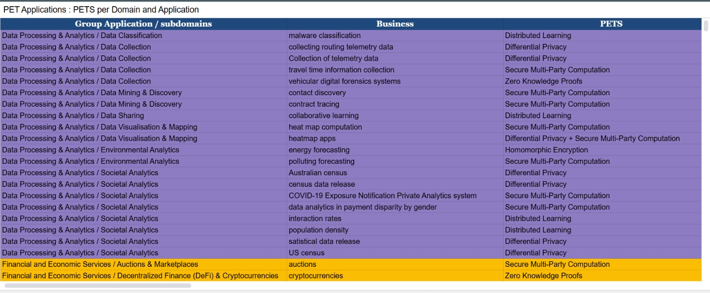

## The Privacy Pattern Guide

The Privacy Pattern Guide is a practical outcome of this study, designed
to help practitioners identify and apply the most appropriate PETs for
specific use cases. It acts as an interactive decision support tool
based on the domain-specific analysis of PET adoption and use. By drawing on insights from a comprehensive
literature review of PET implementations, the guide bridges the gap
between research findings and real-world technical needs.

**[Explore the Privacy Pattern Guide](https://docs.google.com/spreadsheets/u/2/d/e/2PACX-1vSlzlIJoQdCJNCo7mWNitzwNGA4yhsv7WhDPQCxc8ZDokVXJ_Dl1i2r2T9zEWhPrMEjwLKUNyOeeHrJ/pubhtml?gid=1038081398&single=true)**

*An example of applications in the technical domain.*

*An example of applications in the business domain.*

The guide is structured as a table that guides engineers and privacy
practitioners to the most relevant PETs based on the specific
characteristics of their use case. Importantly, the guide reflects the
patterns identified in mapping PETs to business and technical domains.
This mapping allowed us to understand not
only where PETs are used, but also how they are used in different
industries and technologies, which provides the empirical basis for the
guide.

By making this guide based on the domain-specific prevalence and
suitability of PETs, we aim to make privacy engineering both more
accessible and more effective. This ensures that the Privacy Pattern
Guide is not a generic recommendation engine, but a research-backed tool
that reflects the current state of the art and practice in PETs.
